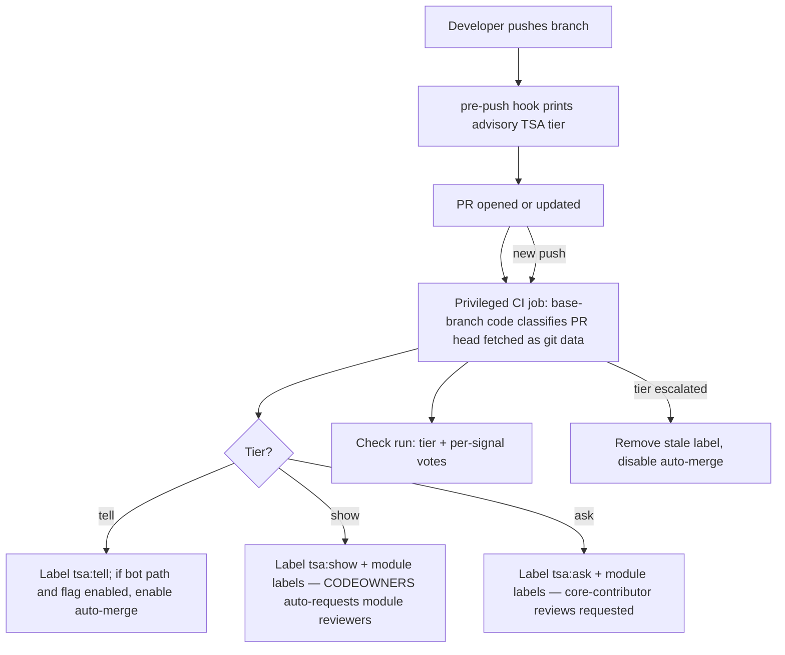

# TSA (Tell / Show / Ask) PR Classification

## Problem Frame

Every PR currently gets the same review ceremony regardless of risk. A Scala Steward version
bump waits on the same human attention as a cross-module breaking change. TSA classifies each
PR into one of three tiers so review effort matches risk:

| Tier | Meaning | v1 policy |
|---|---|---|
| **Tell** | Small, inoffensive | Labeled; bot-authored dependency bumps additionally auto-merge once CI passes (behind a flag) |
| **Show** | Needs a human look | Advisory label routing review to the touched module's contributors |
| **Ask** | High risk / high blast radius | Advisory label signaling core-contributor review with multiple sign-offs |

**Why not existing tools?** Bot auto-merge alone is achievable with a small GitHub workflow, and
Mergify/Kodiak/labeler cover generic path-based tiering. This ships as a Mill plugin because the
interesting signals are build-aware — module fan-out from Mill's own module graph today,
build-integrated quality/coverage/mutation signals in v2 — and because consuming repos already
standardize on this plugin suite. The classifier engine itself stays forge-light so the GitHub
glue is thin.

## User Flow

## Requirements

**Classification engine**
- R1. A Mill task computes the TSA tier for a diff range (default: `HEAD` vs merge-base with the main branch) and emits it in human-readable and machine-readable form. The machine-readable output includes per-signal votes and abstentions, so consumers can audit *why* a tier was assigned and gate auto-merge on a voting quorum.
- R2. Each signal votes a *minimum* tier or abstains; the final tier is the maximum across votes with **Show as the floor**. Only signals explicitly designated *downgrade-capable* (in v1: R15 and the docs-only/test-additive predicate) can lower the result to Tell, and only when no non-overridable Show/Ask vote exists; only R15 makes a PR auto-merge-eligible. The monotonicity guarantee is relative to votes: user-added signals are escalate-only by default and can only tighten the result; loosening requires the explicit downgrade-capable opt-in.
- R3. Abstention semantics are split: a signal that is *unconfigured* abstains everywhere; a signal that is *configured but fails at runtime in CI* floors the result at Show and is reported in the output (fail-safe, not fail-open). Local runs always abstain on unavailable data.

**Signals (v1 defaults)**
- R4. Conventional-commit type mapping: `docs`/`chore`/`style` → Tell; `feat`/`fix` → Show; breaking-change marker (`!` / `BREAKING CHANGE` footer) → Ask. Reuses the conventional-commit grammar from the existing validator, refactored to expose the parsed type; commit-range iteration and footer parsing are new code.
- R5. Diff size and file class: LOC / file-count thresholds; docs-only diffs → Tell; test-only diffs → Tell **only when net-additive or modifying** — test deletions → Show (removing tests weakens the safety net while keeping CI green); changes to build files, CI workflows, release/publishing code, or the hooks themselves → Ask. The docs-only/test-additive Tell predicate is downgrade-capable (per R2), so trivially safe human PRs earn the `tsa:tell` label — without ever being auto-merge-eligible. Thresholds and path globs overridable.
- R6. Module fan-out: single-module change stays at the tier voted by other signals; changes spanning multiple modules → Ask. Requires a new `moduleDir`-based mapping from changed paths to modules (the existing `validModules` yields only last-segment names); paths matching no module (root files, `docs/`, `.github/`) get explicitly defined handling.
- R15. Trusted-bot dependency signal — the only downgrade-capable v1 signal: votes Tell iff the PR author is on a configured trusted-bot allowlist (verified forge login, **not** forgeable commit metadata) **and** the diff is confined to dependency-version declarations (only version literals of existing dependencies may change). When it fires, it overrides the default votes that would otherwise block it (R4's unparseable-commit vote, R5's build-file and size votes) — but never an explicit breaking-change Ask vote; this is the deliberate, narrowly scoped carve-out that lets Scala Steward bumps reach Tell.

**Customization**
- R10. Users add, remove, or replace signals by overriding a single `def` in their build file, consistent with the plugin's existing config style. v1 ships concrete implementations only; the signal-override `def` is the sole extension point (no per-signal provider interfaces until a second real provider exists).

**Execution points**
- R12. Pre-push hook prints the computed tier as advisory early feedback. Cheap signals only; data-dependent signals abstain locally.
- R13. CI runs a single privileged workflow that checks out **base-branch code only**, fetches the PR head purely as git data, computes the tier, and applies the `tsa:tell|show|ask` label. It never executes build code from the PR head — no v1 signal needs PR code execution, so the earlier split classify/label architecture is deferred to v2 (when R7–R9 must execute PR builds). Fork PRs are classified and labeled, never auto-merged. Classification runs on every push to the PR; stale `tsa:*` labels are removed. A human-applied override label (e.g. `tsa:override:*`) is respected and never clobbered by re-runs — misclassification must always have a recourse.
- R16. The privileged job posts a check run whose summary shows the tier and the per-signal votes/abstentions (the R1 machine-readable output) — reviewers see *why* a PR is Show/Ask in the checks tab, and abstaining signals are visible rather than silent.
- R17. The privileged job also applies per-module labels for the touched modules (reusing the R6 path→module mapping), making "review by a contributor of the touched module" filterable.
- R18. Review routing: Show relies on GitHub's native CODEOWNERS auto-request (the consuming repo's CODEOWNERS file routes module reviews with no plugin code); for Ask, the privileged job additionally requests reviews from a configured core-contributor list — a flat overridable `def`, deliberately not the deferred R11 ownership provider.
- R19. Docs ship a copy-paste reference workflow implementing the split classify/label architecture, plus the label-creation commands and token setup. No scaffolding task in v1 — manual, but the dangerous part (the privileged/unprivileged split) is copied from a correct reference rather than hand-designed.
- R14. Auto-merge ships **off by default** behind a config flag. When enabled, only PRs classified Tell via R15 (trusted bot + dependency-only diff) get GitHub auto-merge enabled; human-authored Tell PRs are label-only in v1. If re-classification escalates the tier, previously enabled auto-merge is disabled. The enabling credential is a PAT or GitHub App token — not the default `GITHUB_TOKEN`, whose merges do not trigger post-merge workflows — with least-privilege scopes documented. Fork PRs are never auto-merged and the privileged job does not run untrusted fork code.

**Deferred to v2** (IDs retained; each can be prototyped as a user-supplied signal via R10 first)
- R7. Code-quality delta via a provider such as CodeScene's delta-analysis API. Credentials via overridable env-var-name `def`s (existing sonar-plugin pattern), never embedded; the provider contract must document exactly what data (paths vs file contents) leaves CI.
- R8. Test coverage over changed lines.
- R9. Mutation score over changed code (no compile-time dependency on the stryker4s plugin module — repo constraint).
- R11. Ownership provider (CODEOWNERS default, replaceable e.g. by CodeScene) **plus its consumer**: a label-gate required status check that re-derives the tier (never trusts the mutable label) and fails until Show/Ask approval policies are met. These ship together — ownership data without the gate check has no call site.

## Success Criteria

- **Shadow phase first**: the classifier is dry-run against the last ~50 merged PRs; the tier distribution is reviewed and sane (Ask is not the modal tier for routine cross-module chores) before the auto-merge flag is enabled anywhere.
- A Scala Steward PR (bot-authored, dependency-only) is labeled `tsa:tell` and, once the flag is on, merges without human interaction after CI is green.
- A cross-module change or one carrying a breaking-change marker is labeled `tsa:ask`.
- A repo user adds a custom escalating signal (e.g. "any `.sql` file → Ask") in a few lines of their `build.mill`, with no plugin changes.
- Running the classifier locally (pre-push) never blocks on network-backed signals.

## Scope Boundaries

- **Show and Ask are advisory in v1.** GitHub branch protection cannot key approval rules on PR labels, so their merge policies are review-routing conventions until the v2 gate check ships. The doc says this honestly rather than assuming enforcement that doesn't exist.
- Human-authored PRs never auto-merge in v1, whatever their tier.
- No blame/familiarity signal, no churn/hotspot analysis in v1.
- GitHub is the only forge targeted in v1.
- No GitHub-side setup automation in v1 — consuming repos copy the reference workflow (R19).

## Key Decisions

- **Both execution points**: the Mill task is the single engine; pre-push gives advisory feedback, CI applies the authoritative label.
- **Tell auto-merge requires bot identity AND dependency-only diff**: every other v1 signal (commit type, size, paths) is author-controlled, and "it passed CI" is not a sufficient safety argument — the tiers exist precisely because CI-green isn't sufficient. The conjunction is the one path where neither input is forgeable by a PR author.
- **Shadow-first rollout**: the irreversible consequence (auto-merge) is not enabled in the same breath as the untested predictor; label-only observation plus a historical dry-run come first.
- **Show is the floor; downgrade is an explicit capability**: fixes the false "max-wins never loosens" claim — a Tell vote's only function is to defeat the default, so the ability to cast one is restricted and opt-in.
- **Advisory Show/Ask in v1**: label-keyed enforcement needs a gate status check (GitHub has no native label-conditional approvals); that check and the ownership provider it consumes are one coherent v2 unit.
- **Fail-safe abstention in CI**: "configured but broken" floors at Show instead of silently vanishing; only "deliberately not configured" abstains cleanly.
- **R7–R9 deferred**: they serve no v1 success criterion and abstain by default; the R10 extension point is precisely the argument for shipping them later.
- **Show routing costs no code**: GitHub natively auto-requests CODEOWNERS-matched reviewers, so a CODEOWNERS file in the consuming repo does Show routing for free; only Ask's core-contributor list (which CODEOWNERS cannot express) is plugin config.

## Dependencies / Assumptions

- CI has credentials able to apply labels; auto-merge enablement uses a PAT or GitHub App token so the resulting merge triggers post-merge workflows.
- CI checkout fetches enough history to compute the merge-base with the target branch (e.g. `fetch-depth: 0`); if the diff range cannot be computed, the classifier fails loudly rather than emitting a tier.
- The trusted-bot allowlist (e.g. the Scala Steward app login) is configured per consuming repo.
- `tsa:*` labels exist in the consuming repo (created by the plugin's install/setup task or documented).

## Outstanding Questions

### Resolve Before Planning
- (none)

### Deferred to Planning
- [Affects R5][Technical] Default LOC/file-count thresholds and the exact default path-glob sets.
- [Affects R15][Technical] How to detect "dependency-version-declarations-only" diffs robustly (patterns over `build.mill` / `mill-build` files).
- [Affects R4][Technical] Multi-commit PRs with mixed types: max across commits, or PR title under squash-merge conventions (note: squash rewrites the message the R4 vote was computed from).
- [Affects R13, R14][Technical] Label application and auto-merge mechanics: `gh` CLI vs REST, idempotency on re-runs, and the fork-PR labeling path (separate privileged workflow vs visible failure).
- [Affects R12][Technical] Which ref the pre-push advisory diffs against when local main is stale relative to origin.
- [Affects R10][Technical] Whether the signal abstraction lives in `githooks` or `core` — cheaper to decide before the API is published and MiMa-checked.

## Next Steps

→ `/ce:plan` for structured implementation planning
