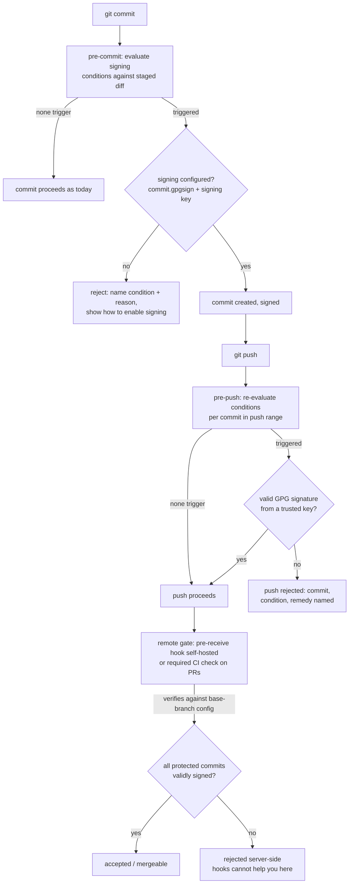

# Conditional Commit Signing for the githooks Plugin

## Problem Frame

The githooks plugin currently installs four hooks (pre-commit, pre-push, prepare-commit-msg, commit-msg) that enforce formatting, selective tests, and commit-message conventions. Nothing guards *what* is being committed. Two classes of change deserve friction: silencing a quality tool (scalafix/scalafmt/CodeScene/Sonar suppression comments) and weakening the test suite (editing or deleting an existing test). The goal: such changes require a GPG-signed commit — a deliberate, attributable act — while everything else stays friction-free. The condition mechanism must be pluggable so teams can add their own triggers.

Mechanical constraint that shaped the design: git signs a commit **after** pre-commit/commit-msg hooks run, so a signature can only be *verified* at pre-push; commit time can only detect the condition and check signing intent.

## Enforcement Flow

Local hooks are fast feedback and remain bypassable (`--no-verify`); the remote gate is the enforcement layer.

## Requirements

**Pluggable condition framework**
- R1. `GitHooksModule` exposes an overridable def of *signing conditions*. Each condition inspects a change-set (staged diff at pre-commit; a single commit's diff at pre-push) and answers: does this change require a signed commit, and why (human-readable reason). Users add custom conditions in `build.mill`; built-ins can be reconfigured or disabled.
- R2. Built-in condition — **exception comments**: triggers when a change *adds* a line matching a configurable marker-pattern set. Defaults cover scalafmt (`format: off`), scalafix (`scalafix:off` / `scalafix:ok`), scalastyle (`scalastyle:off`), Sonar (`NOSONAR`), CodeScene disable directives, `@nowarn`, `@SuppressWarnings`. Removing a marker never triggers.
- R3. Built-in condition — **test protection**: case-level over all test sources. A removed or modified existing test case triggers; purely additive changes never trigger — new test cases, new test files, and pure insertions inside an existing case body (no removed lines). *(Boundary clarified during plan review: removed-line intersection is the detection primitive; the pure-insertion allowance is documented as a known evasion vector for human review.)*
- R13. Built-in condition — **protected paths** *(added during plan review)*: any change to a configurable glob set — defaulting to the trusted-keys directory and common quality-tool config files — triggers. Closes the two channels the other conditions miss: mutating the trust store itself, and silencing a tool by editing its config instead of adding a marker comment.

**Enforcement points**
- R4. Pre-commit: when any condition triggers on the staged diff, the commit is rejected unless commit signing is configured (`commit.gpgsign` true and a signing key set — the `-S` flag is invisible to hooks, so configuration is the checkable proxy). The rejection message names each triggered condition, its reason, and how to comply.
- R5. Pre-push: for every commit in the push range whose diff triggers a condition, the commit must carry a GPG signature that verifies as **valid and from a trusted key**. Otherwise the push is rejected, naming the commit, condition, and remedy. This is the authoritative check; pre-commit is fast feedback.
- R6. The trusted-signer set is configured in the build (overridable def of key fingerprints/identities), so changes to who may sign are themselves code-reviewed.

**Remote enforcement (non-bypassable layer)**
- R10. A range-taking verification command (e.g. `./mill git.verifyRange <old-sha> <new-sha>`) runs the same condition-evaluation + trusted-key signature verification as pre-push over an arbitrary commit range, exits non-zero with a per-commit report. Usable as a required CI status check on PRs (the GitHub.com path — combined with branch protection blocking direct/force pushes).
- R11. When run as a remote gate, verification loads trusted keys and condition configuration from a **single configured trust-root ref** (default: the repository's default branch) — never from the commits under review, the pushed tree, or the PR's own base/head — so an attacker cannot whitelist their own key or delete a condition in the same change, target a less-guarded side branch, or bootstrap trust with a new-branch push. Docs cover CODEOWNERS-protecting that config (including the CI workflow files themselves). *(Strengthened during plan review from "the protected base ref": a per-operation base ref left side-branch targeting and new-branch bootstrap open.)*
- R12. Pre-receive hook support for self-hosted git servers (Gitea, GitLab self-managed, GHE): the plugin provides a server-side hook that runs the same verification per pushed ref. True push-time enforcement where the platform allows it.

**Configuration & UX**
- R7. All configuration follows the existing plugin style: scaladoc'd overridable `def`s on the trait, no `sys.env`, no embedded credentials/URLs (public key fingerprints are fine).
- R8. Zero added friction when no condition triggers — unaffected commits and pushes behave exactly as today.
- R9. Enforcement is wired into the hooks generated by `install()`; an existing install picks it up on reinstall (`--force` semantics preserved).

## Success Criteria
- Committing a change that adds a `NOSONAR` line without signing configured fails at pre-commit with the condition named; with signing configured it commits, and push succeeds when the signature is valid and trusted.
- Deleting or editing an existing test case in an unsigned commit is rejected at pre-push; adding a new test case requires no signature anywhere.
- A custom condition defined in `build.mill` is enforced identically to the built-ins at both hooks.
- A commit touching nothing protected goes through both hooks with no new checks visible.
- A protected, unsigned commit pushed with `--no-verify` is still rejected by the remote gate (required CI check or pre-receive hook).
- A PR that edits the trusted-key list cannot use its own edit to pass verification — the gate reads config from the base ref.

## Scope Boundaries
- Local hooks are convenience/feedback, not security — `--no-verify` bypasses them by design; the remote gate (R10–R12) is the enforcement layer.
- GitHub.com cannot run custom pre-receive hooks; there the ceiling is required CI check + branch protection. Repo admins can always bypass their own rules — governance floor, not technical.
- No blanket signing requirement — commits that trigger no condition may stay unsigned.
- No key distribution or keyserver management beyond the configured trusted-key set.
- No retroactive verification of existing history — only the staged diff and the outgoing push range.

## Key Decisions
- **GPG signature, not Signed-off-by trailer**: cryptographic attribution, not a forgeable attestation. (User choice.)
- **Both enforcement points**: pre-commit for early intent feedback, pre-push for real verification — because signing happens after commit-time hooks. (User choice.)
- **Test protection is case-level across all tests**: additive edits to a test file stay friction-free; only touched/removed existing cases trigger. (User choice.)
- **Verification depth = valid + trusted key** at pre-push, not mere signature presence. (User choice.)
- **Exception-comment rule fires on added lines only**: committing near an existing marker, or removing one, never triggers.
- **Layered enforcement**: local hooks = fast feedback (bypassable), remote gate = enforcement (CI required check everywhere, pre-receive on self-hosted). One shared verification engine so the layers can't drift. (User choice.)
- **Remote gate reads config from the base ref**: prevents self-approval by editing trusted keys/conditions in the change under review.

## Dependencies / Assumptions
- Plugin stays JGit-based (no shelling to `git`) where feasible; JGit exposes `RevCommit.getRawGpgSignature` and a BouncyCastle-based signature verifier.
- Shared git utilities that other plugins might need belong in `core` (plugins must not depend on each other).

## Outstanding Questions

### Resolve Before Planning
- (none)

### Deferred to Planning
- [Affects R5][Needs research] Verification mechanism: JGit's BouncyCastle verifier (`org.eclipse.jgit.gpg.bc`) vs invoking `git verify-commit`; and how trusted public keys are materialized (local keyring lookup by fingerprint vs armored keys in repo config).
- [Affects R3][Technical] Test-case detection: diff-hunk intersection against utest `test("...")`/ScalaCheck property blocks; handling file renames and moved cases; whether the case-matcher is itself a configurable pattern.
- [Affects R5][Technical] Merge commits and other authors' commits inside the push range: enforce on all (proposed default) vs exempt non-authored commits; make exemption configurable.
- [Affects R1][Technical] Relationship to the planned TSA signal-trait design (`docs/plans/2026-07-29-001-feat-tsa-pr-classification-plan.md`): share its diff-plumbing/condition shape or keep a separate minimal trait.
- [Affects R4/R5][Technical] Hook wiring: new `./mill git.<cmd>` invocations in the generated pre-commit/pre-push scripts, new `WorkDone` flag(s), MiMa filter for `GitInstall` constructor churn (established precedent).
- [Affects R12][Needs research] Pre-receive deployment: the server side is a bare repo with no Mill workspace — verification likely ships as a standalone runnable artifact (assembly JAR) the hook invokes; per-platform hook interfaces (Gitea/GitLab/GHE) and how base-ref config is loaded there.
- [Affects R11][Technical] Exact mechanism for reading trusted-key/condition config from the base ref in CI (checkout of base ref vs `git show base:path`) and which config is ref-pinned vs local.

## Next Steps
→ `/ce:plan` for structured implementation planning (no blocking questions remain).
