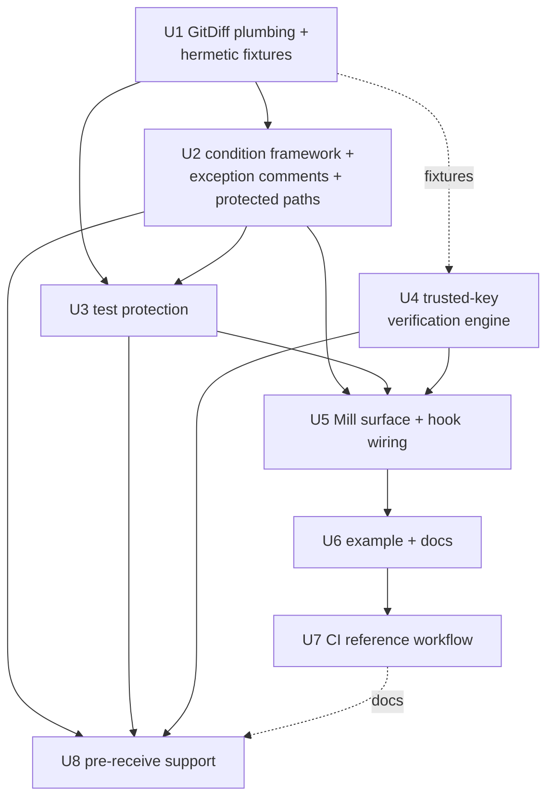

# feat: Conditional commit signing

## Overview

Add pluggable *signing conditions* to the githooks plugin: changes that add quality-tool
suppression comments, edit/delete existing test cases, or touch protected paths (the trust
store, tool configs) require a GPG-signed commit from a trusted key. Enforcement is
layered — pre-commit detects and checks signing intent, pre-push cryptographically
verifies, and a remote gate (required CI check everywhere, pre-receive hook on self-hosted
servers) makes it non-bypassable. One Mill-API-free verification engine backs all three
layers.

## Problem Frame

Nothing currently guards *what* is committed: silencing scalafix/scalafmt/CodeScene/Sonar
or weakening tests carries the same ceremony as any other change. Protected changes should
require a deliberate, attributable act (a GPG signature from a trusted key) while all other
commits stay friction-free (see origin: docs/brainstorms/2026-08-20-conditional-commit-signing-requirements.md).

Mechanical constraint carried from the origin: git signs a commit *after* pre-commit runs,
so commit time can only check intent; real verification happens at pre-push and at the
remote gate.

## Requirements Trace

- R1 (pluggable conditions) → Units 2, 5
- R2 (exception-comment condition) → Unit 2
- R3 (test-protection condition, case-level; additive boundary clarified in origin) → Unit 3
- R4 (pre-commit intent check) → Unit 5
- R5 (pre-push valid + trusted verification) → Units 4, 5
- R6 (trusted signers configured in the build) → Unit 4 (see Key Technical Decisions — keys dir, not fingerprint def)
- R7 (overridable-def config style) → Units 2–5
- R8 (zero friction when inactive) → Unit 5 (activation model)
- R9 (wired via `install()`) → Unit 5
- R10 (range verification command for CI) → Units 5, 7
- R11 (gate reads config from a trust-root ref; origin updated to match this strengthening) → Units 7, 8
- R12 (pre-receive for self-hosted) → Unit 8

## Scope Boundaries

- OpenPGP signatures only in v1 (origin user decision — GPG was chosen explicitly).
  SSH-signed commits (`gpg.format=ssh`) pass pre-commit (a hook cannot know the future
  signature's format) and are rejected at the verification layers as unverifiable, with a
  message naming the limitation. JGit supports SSH verification
  (`org.eclipse.jgit.ssh.apache` + `SigningKeyDatabase`), deliberately deferred (sshd
  dependency tree, second fingerprint namespace); revisit if the adopter population proves
  SSH-dominant.
- Local hooks are feedback, not security (`--no-verify` bypasses); the remote gate is the
  enforcement layer. Admin bypass of branch protection is a governance floor.
- Custom Scala conditions run locally and in CI (both run Mill against trusted checkouts).
  The server-side pre-receive gate enforces the *built-in* conditions with defaults plus
  trusted keys from the trust-root ref — it cannot evaluate `build.mill` (see decisions).
- Suppression via tool *config files* is guarded only as far as the ProtectedPaths default
  glob set reaches (see decisions); semantic weakening inside CI definitions or build logic
  beyond those globs is out of v1 scope — CODEOWNERS guidance covers the remainder.
- No blanket signing requirement; unprotected commits may stay unsigned.
- No retroactive history verification; no keyserver interaction. Revocation is honored only
  when embedded in the armored key material or effected by removing the key file from the
  trust root — the compromise window until that removal is an accepted limitation.

## Context & Research

### Relevant Code and Patterns

- `githooks/src/atn/mill/GitHooksModule.scala` — scaladoc'd overridable-`def` config style;
  `Task.Command(exclusive = true)` + `EvaluatorProxy` command idiom; `prePush` shows
  resolve/execute against the evaluator.
- `githooks/src/atn/mill/GitInstall.scala` — hook-script templating (`writeNext`, 0755,
  sh/Windows split, `filePrefix`/`cmd` vals); constructor grows params exactly as
  `selectivePreCommitTasks` did (MiMa filter precedent at `build.mill:141`). Note:
  `writeNext` skips existing hook files without `--force` — activation changes need a
  loud warning (see Unit 5).
- `githooks/src/atn/mill/GitPrepCommit.scala` — JGit staged-diff precedent
  (`git.diff().setCached(true)`, `DiffFormatter`).
- `githooks/src/atn/mill/WorkDone.scala` — upickle-serializable result ADT precedent.
- `core/src/atn/mill/GitRepo.scala` — `Result`-wrapped repo access. **Caution:** `Result`
  is `mill.api.daemon.Result`, a Mill API type — off-limits inside the Mill-free layer
  (see decisions); `GitRepo` itself is likewise not usable from `VerifyMain`'s path.
- Tests: `githooks/test/src/atn/mill/GitHooksModuleTest.scala` — hook-script substring/order
  assertions + `UnitTester` fixtures. No JGit fixture-repo tests exist yet; Unit 1
  establishes the pattern and a shared, **config-hermetic** fixture helper.
- Build: Mill API is `compileMvnDeps` (provided, absent from the published POM); jgit is
  `mvnDeps` (runtime). Published artifact resolves as `mill-githooks_mill1_3` on Maven
  Central (`artifactName` `mill-githooks_mill1` + Scala 3 suffix). MiMa-exclusion precedent
  for internal classes: `MillTestRunner` (`build.mill:100–107`). Local artifact staging
  precedent: `localM2Repo`/`COURSIER_REPOSITORIES` in `MillPluginExampleTests`.
- **TSA plan** (`docs/plans/2026-07-29-001-feat-tsa-pr-classification-plan.md`, active, not
  yet implemented): its Unit 1 specs a `GitDiff.scala`; its pre-push design reserves the
  `while read local_ref local_sha remote_ref remote_sha` stdin block; its Unit 6 workflow
  establishes the trusted-checkout CI posture this plan reuses. Ownership of the shared
  pieces is decided below; the TSA plan carries a matching coordination note (verified
  present).

### Institutional Learnings

- No `docs/solutions/` exists. From project memory: `exclusive = true` commands cannot take
  an `Evaluator` param under ExampleTester (resolve-only Usage lines); ExampleTester
  `/** Usage */` blocks are parsed as Scala (no quotes/brackets/`for`); MiMa locks published
  API — keep new public surface minimal; release module is `rel`; Scala Steward PRs are
  created with `GITHUB_TOKEN` and fire no `pull_request` events (ci.yml works around this
  with explicit dispatch) — load-bearing for Unit 7.

### External References

- JGit 7.7.1 signature verification (verified against tag sources, 2026-08-20):
  - 6.x `GpgSignatureVerifier`/factory API was **removed in 7.0**; 7.7 exposes
    `org.eclipse.jgit.lib.SignatureVerifier` (interface),
    `SignatureVerification` (record: `keyFingerprint`, `verified`, `expired`, `trustLevel`,
    `message`), and the static facade `SignatureVerifiers`
    (`verify(Repository, GpgConfig, RevObject)` → null when unsigned/unknown format;
    `getFormat`; `set(GpgFormat, SignatureVerifier)` — JVM-global registry, deliberately
    NOT used, see decisions).
  - OpenPGP verification artifact: `org.eclipse.jgit:org.eclipse.jgit.gpg.bc:7.7.1.202607240634-r`
    (drags BouncyCastle `bcpg/bcprov/bcutil/bcpkix-jdk18on:1.84`). Pure JVM — never shells to gpg.
  - The stock BC verifier reads only a GPG home keyring (`jgit.gpg.home` sysprop resolved in a
    **static-final initializer** → env `GNUPGHOME` → `~/.gnupg`); there is **no programmatic
    key-injection API** — hence the custom-verifier decision below. The static-final
    resolution also makes a temp-`GNUPGHOME` test strategy fragile (must be set before
    class load), which argues for in-memory BC test keys.
  - `RevCommit.getRawGpgSignature` covers the `gpgsig` header for all formats (OpenPGP, SSH,
    x509); `SignatureVerifiers.getFormat` classifies the blob.
  - JGit has **no built-in combined-diff** (`git show --cc`) — the merge-combined accessor
    is hand-rolled by intersecting per-parent diffs (contract defined in decisions).
  - Pitfalls that shaped this plan: subkey signatures report the **subkey** fingerprint;
    `verified=true` can coexist with `expired=true`; `trustLevel` is useless outside a real
    keyring (gate on `verified` + allowlist); only the first signature of a multi-signature
    blob is verified by BC; key-lookup failures throw unchecked `JGitInternalException`;
    fingerprint may degrade to a 16-hex long key ID for pre-2016-style signatures (such
    signatures are rejected, not suffix-matched — see decisions); embedded revocation
    signatures in armored rings are exposed by BC but ignored unless we filter them;
    JGit's config chain includes user/system git config via `SystemReader` (test
    hermeticity requirement, Unit 1).

## Key Technical Decisions

- **All new code lives in `githooks`; core untouched** — one-consumer rule, same reasoning
  the TSA plan recorded. Graduate shared pieces to `core` only when a second plugin needs them.
- **This plan owns `GitDiff`; the spec covers signing's needs only.** Unit 1 implements
  what the conditions consume: staged-diff, per-commit, and merge-combined change-sets with
  rename detection, binary flags, and lazy patch text. TSA-only accessors
  (`firstParentCommits`, submodule flags) are **not** pre-built — the TSA plan extends the
  same file when it lands (its coordination note says so); pre-building them here would
  ship untested speculative surface, the pattern this codebase's one-consumer rule exists
  to prevent. `GitDiff` is internal and MiMa-excluded (the `MillTestRunner` precedent)
  until both plans have landed. Likewise the pre-push stdin block: **this plan owns the
  block's shape** (enforcing `verifyRange` call); TSA later adds its exit-0-guarded
  advisory line inside the same block.
- **Combined-diff contract for merge commits** (JGit has no built-in): an *added* line is
  present in the merge result and absent from **all** parents; a *removed* line is present
  in **all** parents and absent from the result (removed-from-any would fire on every
  merge of divergent branches). For TestProtection, regions are resolved per parent — each
  diff leg classifies and extracts against its own parent's path and content — and a
  removed line triggers only when it falls inside a case region in every parent where the
  file exists. Consequence: a merge deleting a test case present in both parents fires; a
  merge where one branch already (signed and verified) deleted it does not re-fire.
- **The Mill-free layer uses its own error types, never `mill.api.Result`**: `GitDiff`,
  `SigningConditions`, `TrustedKeys`, `SigningVerify`, `SigningReport`, and `VerifyMain`
  express failures as `Either`/`Try`/their own ADTs; conversion to Mill's `Result` happens
  only inside `GitHooksModule`. Rationale: all of these are on `VerifyMain`'s coursier-launch
  classpath, where Mill API classes (provided scope) do not exist — one leaked type is a
  server-side `NoClassDefFoundError`.
- **`SigningCondition` is a separate minimal trait, not `TsaSignal`** (resolves the origin's
  deferred question): signing needs boolean-plus-reason over one change-set; TSA needs tier
  voting with downgrade semantics.
- **Three built-in conditions.** ExceptionComments and TestProtection per the origin, plus
  **ProtectedPaths**: fires on *any* change to a def-overridable glob set defaulting to the
  trusted-keys dir and common tool-config files (scalafix/scalafmt/scalastyle/sonar
  configs). This closes two independently found holes with one mechanism: (a) trust-store
  mutation — since remote gates load keys from the trust root's *pre-push* state, a change
  under `.mill-signing/` must be signed by a key already trusted before the change,
  defeating two-push key insertion on self-hosted servers; (b) config-file suppression —
  silencing a tool by editing its config instead of adding a marker comment was otherwise
  the cheapest unguarded evasion. Docs recommend extending the globs with platform CI
  paths.
- **Trust = armored public keys versioned in the repo** (default `.mill-signing/trusted-keys/`,
  dir overridable as a def). This adjusts R6's letter (fingerprint-list def) while keeping its
  intent — trust changes are code-reviewed — and buys what a fingerprint def cannot: the
  remote gates read the *same key material* from a git tree via JGit without evaluating
  Scala. Allowlist = full 40-hex fingerprints of all keys **and subkeys** found in those
  files, **excluding any key or subkey carrying a valid embedded revocation signature**.
  Loading a key matching a known platform shared key (GitHub web-flow) is refused without
  an explicit override — trusting it would collapse attribution to "has push access".
- **Trust-root provenance, wired per context** (default trust root: the repository's
  default branch): local hooks and CI `verifyRange` load keys from `trustedKeysDir` in the
  working tree — CI fidelity comes from the workflow checking out the trust-root branch,
  so no Mill def needs to name the ref; `VerifyMain` (pre-receive) takes the trust-root
  ref as a CLI argument defaulting to the bare repo's HEAD symref and loads keys from that
  ref's tree, *never* from the pushed tree — including zero-old-sha new-branch pushes.
  There is deliberately **no `signingTrustRootRef` Mill def**: no Mill-side code could
  consume it (CI reads the checkout, the server can't read defs), and a def that silently
  does nothing at the layers that matter is a trap.
- **Bootstrap ordering is a hard prerequisite**: the first trusted key lands on the trust
  root *before* the pre-receive hook is installed (or via an admin server-side ref update).
  A missing keys dir at the trust root is a configuration error **only for pushes
  containing protected commits** — unprotected pushes pass without verification, so
  non-adopting repos on a shared server are unaffected.
- **Custom `SignatureVerifier`, invoked directly — the JVM-global registry is never touched**:
  parse the armored keys with BouncyCastle, verify, compare fingerprints. Direct
  per-invocation construction avoids the static-final GPG-home trap, the registry
  read-modify-write race in the long-lived Mill daemon, and stale negative-key caches
  (payload extraction from the raw commit buffer rather than via `SignatureVerifiers.verify`).
- **Gate predicate: `verified && !expired` && full-fingerprint ∈ allowlist.** `trustLevel`
  ignored. 16-hex-long-key-ID-only signatures rejected as untrusted — no suffix matching.
  Multi-signature blobs rejected as invalid. Distinct failure taxonomy: unsigned /
  signature-invalid / key-not-trusted / revoked / expired / unverifiable-format. The
  key-not-trusted message is distinct from signing-not-configured and carries the correct
  remedy for each (see the untrusted-contributor decision below).
- **Signer identity is not bound to commit author/committer in v1**: any trusted key may
  vouch for any commit — attribution resolves to the signing fingerprint, not the log
  identity. This is a deliberate, documented posture (impersonation within the trusted
  group is possible); an optional committer-to-key-UID binding check is a designed-for
  follow-up in the verdict taxonomy.
- **Untrusted contributors have a defined remedy path**: contributors without a trusted key
  *will* legitimately touch protected patterns. The rejection message and `signing.md`
  document the workflow — a trusted maintainer re-signs the branch (checkout →
  amend/rebase with `-S`) or countersigns before merge; "add your key to the trust root"
  is correctly described as a maintainer-approved trust change, never a self-service fix.
- **Enforcement diffs are computed raw**: `.gitattributes` diff/binary/filter settings are
  not honored, and a change to an otherwise-inspectable path that still cannot be
  text-diffed is **fail-closed** — it counts as a trigger requiring a trusted signature.
- **GitHub adoption requires disabling squash and rebase merges** (reference
  branch-protection config, Unit 7). Both strategies create *new* commits at merge time —
  signed by GitHub's web-flow key or unsigned — that land on the protected branch after
  the required check ran on the PR head, and are never verified by anything. Only "create
  a merge commit" preserves the verified commits; the GitHub-generated merge commit itself
  passes via the combined-diff rule. History rewriting on the client (rebase, amend,
  `pull.rebase`, GitHub's "update branch with rebase") likewise destroys trusted
  signatures and requires re-signing — documented, with merge-based updating recommended.
- **Activation = trusted keys present**: `install()` emits the signing lines into the hooks
  only when the trusted-keys dir contains keys (overridable def for explicit control).
  Existing users and default installs see zero change (R8); configuring keys *is* opting in.
  Drift between install-time and runtime state is defined behavior — see Unit 5.
- **Pre-commit intent check = `commit.gpgsign=true` only.** `user.signingkey` is not
  required — git signs correctly without it (gpg selects the key by committer identity).
- **Pre-commit reads the commit's real index**: `git commit -a` and pathspec commits build
  a temporary index exposed via `GIT_INDEX_FILE`, which a daemon-side JGit never sees on
  its own — the generated hook line passes it explicitly (e.g. `--index "$GIT_INDEX_FILE"`
  when set). Merge-in-progress commits (`MERGE_HEAD` present) are skipped with an
  informational notice deferring to pre-push — a staged diff during a merge shows the
  entire merged branch as added, which would false-reject routine merges.
- **Verification engine is Mill-API-free** (JGit + BC only): the same published JAR runs
  server-side via `VerifyMain` launched by coursier — no assembly module needed. Launch
  coordinate (Scala 3 suffix is required; `::` would resolve a nonexistent 2.13 artifact):
  `cs launch com.adtechnacity:mill-githooks_mill1_3:<v> --main-class atn.mill.VerifyMain`.
- **Pre-push parses the stdin ref protocol**: `while read local_ref local_sha remote_ref
  remote_sha` gating `git.verifyRange` — skip tag pushes and deletions; new-branch pushes
  (zero old-sha) verify commits not reachable from existing remote refs. The block
  consumes all of stdin itself and redirects stdin away from Mill invocations (a Mill
  client that reads stdin would swallow ref lines) — pinned by a script-shape test.
- **Server-side gate enforces built-ins + defaults**: pre-receive cannot run `build.mill`,
  so it applies the three built-in conditions with default config and trusted keys from
  the trust-root ref. **This includes key provenance**: `trustedKeysDir` overrides do not
  reach the server — self-hosted deployments must keep the default path (or mirror the
  override into server config), documented prominently; a relocated keys dir must fail
  closed, never fall back to trusting a stale directory. Full-fidelity custom conditions
  run in CI.

## Open Questions

### Resolved During Planning

- Verification mechanism (origin, needs-research): custom BC-backed verifier fed by
  repo-versioned armored keys, invoked directly — see decisions and External References.
- How trusted keys are materialized (origin, needs-research): armored key files in-tree; no
  keyring, no keyserver; revoked keys/subkeys filtered; platform shared keys refused.
- Remote-gate config provenance (origin): trust-root wiring per context (CI = trusted
  checkout; pre-receive = ref argument defaulting to HEAD symref); origin R11 updated to
  record the strengthening from per-PR base ref to a single trust root.
- Merge/other-author commits (origin): enforce all in range on the combined-diff contract
  (added = absent from all parents; removed = present in all parents); no exemption knob.
- TSA relationship (origin): `GitDiff` owned here with signing's accessors; TSA extends
  the file when it lands; condition/signal ADTs stay separate.
- Verifier registration (was deferred): resolved — direct invocation.
- Trust-store and config-file suppression channels: closed by the ProtectedPaths built-in.
- Pre-commit fidelity for `git commit -a`/pathspec/merge commits: `GIT_INDEX_FILE` passed
  explicitly by the hook; `MERGE_HEAD` → skip with notice.

### Deferred to Implementation

- Exact test-case region grammar for utest/ScalaCheck detection and its configurability
  surface — iterate against real diffs; Unit 3's fixtures are the acceptance tests.
- Signed-commit fixture mechanism: in-memory BC-generated key + `CommitBuilder` is the
  leading option (temp-`GNUPGHOME` is fragile — `jgit.gpg.home` resolves in a static-final
  initializer); lives in the shared `GitFixtures` helper.
- Zero-old-sha (new branch) *range computation* details in `verifyRange`, including
  behavior under stale remote-tracking refs (key provenance is decided: trust root).
- Whether Mill forwards hook-process env (`GIT_INDEX_FILE`) to daemon-executed tasks — if
  it does, the explicit `--index` argument is belt-and-braces; if not, it is load-bearing.
  Verify early in Unit 5.
- Whether the pre-receive main reads an optional in-tree properties file to override marker
  patterns server-side, or ships defaults-only in v1. **Constraint that travels with this
  question:** any such override is loaded exclusively from the trust-root ref's tree —
  never from the pushed tree — mirroring the trusted-keys provenance rule.

## High-Level Technical Design

> *This illustrates the intended approach and is directional guidance for review, not
> implementation specification. The implementing agent should treat it as context, not code
> to reproduce.*

```text
githooks (new files, package atn.mill; everything below GitHooksModule wiring is
Mill-API-free — own error ADTs, no mill.api types):

  GitDiff            owned here; TSA extends later: changedFiles(base, head) with rename
                     detection + binary flags + lazy patch text / stagedChanges(indexFile?)
                     / commitChanges(commit) / mergeCombinedChanges(commit)
                     — raw text diffs, .gitattributes not honored
                     combined contract: added = absent from ALL parents;
                                        removed = present in ALL parents

  SigningCondition   { name; appliesTo(change-set): Option[Reason] }
  SigningConditions  built-ins + defaults:
                       ExceptionComments(markerPatterns)   — ADDED lines matching a marker
                       TestProtection(testCasePatterns)    — removed/modified lines inside
                                                             an existing test-case region
                                                             (old path, old content);
                                                             pure additions never fire
                       ProtectedPaths(globs)               — ANY change under the trusted-
                                                             keys dir or tool-config globs
                     undiffable change on an inspectable path — fires (fail-closed)
  TrustedKeys        load armored keys from a worktree dir OR a git ref's tree →
                     full-fingerprint allowlist incl. subkeys, minus revoked;
                     refuses known platform shared keys (web-flow) without override
  SigningVerify      verify(commit): Unsigned | Unverifiable(format) | Invalid |
                     Untrusted(fp) | Revoked(fp) | Expired | Trusted(fp)   (BC-backed,
                     direct invocation, per-call state)
  SigningReport      upickle ADT (WorkDone precedent): per-commit condition hits + verdicts

  GitHooksModule     new defs: signingConditions, exceptionCommentMarkers,
                     testCasePatterns, protectedPathGlobs, trustedKeysDir,
                     signingEnforcement (derived: keys present)
                     new commands: checkSigning(index?) [pre-commit: staged diff via the
                     hook-provided index → conditions → intent check commit.gpgsign;
                     MERGE_HEAD → skip with notice], verifyRange(old, new, lenient)
  GitInstall         pre-commit gains a checkSigning line passing "$GIT_INDEX_FILE";
                     pre-push gains the stdin while-read block calling verifyRange
                     (lenient), reading all of stdin itself — both emitted only when
                     signing is active; activation-state mismatch against existing hook
                     content warns loudly, naming --force
  VerifyMain         thin CLI over the engine for pre-receive (stdin protocol: old new ref
                     per line; --trust-root-ref arg, default: bare repo HEAD symref),
                     keys + built-in defaults from the trust-root ref's tree
```

Enforcement-layer decision matrix (encoded as tests in Units 4–5, workflow rows asserted in
Unit 7's scratch-repo validation):

| Commit state | pre-commit | pre-push / CI / pre-receive |
|---|---|---|
| No condition triggers | pass (no signing demanded) | pass |
| Triggers, signing configured, later signed by trusted key | pass | pass |
| Triggers, signing not configured | reject with reasons | (never reached locally) |
| Triggers, unsigned (hook bypassed) | — | reject: unsigned + reasons |
| Triggers, signed by unknown key | pass (intent ok) | reject: key not in trust root — remedy: maintainer re-sign or trust change |
| Triggers, signed by revoked key/subkey | pass | reject: revoked |
| Triggers, signed but key expired at signing time | pass | reject: expired |
| Triggers, SSH-signed | pass | reject: unverifiable format (v1 GPG-only, message says so) |
| Signature exposes only 16-hex key ID / multi-signature blob | — | reject: untrusted / invalid |
| Undiffable (binary/attribute-filtered) change to inspectable path | reject unless signing configured | trusted signature required (fail-closed) |
| Change under ProtectedPaths globs (trust store, tool configs) | reject unless signing configured | trusted signature required (keys = pre-change trust root) |
| `git commit -a` / pathspec commit adding a marker | reject unless signing configured (temp index honored) | as any protected commit |
| Merge in progress (`MERGE_HEAD`) | skip with notice | per combined-diff rows below |
| Pure merge commit, combined diff empty | (skipped) | pass (regardless of merge signature) |
| Merge whose conflict resolution adds protected content | (skipped, notice) | trusted signature required |
| Merge deleting a test case present in all parents | (skipped, notice) | trusted signature required |
| Protected commit rewritten by rebase/amend before push | — | reject: unsigned/untrusted — remedy: re-sign (documented) |
| Stale hook line, signing since deactivated | pass with notice (lenient) | strict contexts: config error |
| Squash/rebase merge on GitHub | — | prevented by adoption prerequisite (strategy disabled); the created commit is otherwise never verified — documented |

## Implementation Units

Dependency graph:



### Phase 1 — local enforcement (R1–R9)

- [ ] **Unit 1: git diff plumbing (`GitDiff`) + hermetic test fixtures**

**Goal:** The change-set accessors signing consumes: staged (with explicit index-file
support), per-commit, and merge-combined views with file paths, added/removed lines,
change types, rename detection, binary flags, lazy patch text. Plus the repo's first JGit
fixture-repo test helper, built config-hermetic from day one.

**Requirements:** R1–R3, R5 (data source for all conditions)

**Dependencies:** None. **Owned here; the TSA plan extends this file when it lands** (its
coordination note matches). Internal + MiMa-excluded until both plans land.

**Files:**
- Create: `githooks/src/atn/mill/GitDiff.scala`
- Create: `githooks/test/src/atn/mill/GitFixtures.scala`
- Test: `githooks/test/src/atn/mill/GitDiffTest.scala`
- Modify: `build.mill` (MiMa exclusion for `GitDiff`, `MillTestRunner` precedent)

**Approach:** JGit `DiffFormatter`/`DiffEntry` with rename detection; staged view via
`setCached(true)` against an explicitly supplied index file when given (the
`GIT_INDEX_FILE` path from the hook); per-commit view diffs against first parent;
merge-combined view hand-rolled per the contract in decisions (JGit has no `--cc`). Diffs
are raw — `.gitattributes` not honored. `GitFixtures` installs a `MockSystemReader` (or
`SystemReader.setInstance` wrapper) so fixture repos see **no user/system git config** —
host machines routinely set `commit.gpgsign` globally, which would otherwise flip Unit 5's
intent tests. **Mill-API-free: failures are the layer's own ADT/`Either`.**

**Patterns to follow:** `GitPrepCommit` diff usage.

**Test scenarios:**
- Happy path: staged modification reports correct added/removed lines per file; staged
  view honors an explicit temp index file distinct from `$GIT_DIR/index`; commit diff vs
  first parent matches `git show` semantics.
- Merge-combined contract: clean merge → empty; conflict-resolution lines → added; a line
  removed relative to all parents → removed; a line one branch already deleted → NOT
  removed on the merge.
- Edge: rename-only reports rename, not add+delete; binary file flagged with no lines; a
  path marked `-diff` in `.gitattributes` still yields text hunks (raw mode); empty staging
  area → empty change-set.
- Error path: no HEAD (fresh repo) → typed failure value, not an exception.
- Hermeticity: a fixture repo ignores a host-level `commit.gpgsign` setting (asserted via
  the mock system reader).

**Verification:** New tests pass; MiMa clean (exclusion in place); no `mill.*` import in
the file.

- [ ] **Unit 2: condition framework + exception-comments + protected-paths conditions**

**Goal:** The pluggable `SigningCondition` trait, evaluation producing per-condition
reasons, upickle-serializable report ADT, the ExceptionComments and ProtectedPaths
built-ins, and the fail-closed undiffable rule.

**Requirements:** R1, R2, R7

**Dependencies:** Unit 1

**Files:**
- Create: `githooks/src/atn/mill/SigningConditions.scala`
- Test: `githooks/test/src/atn/mill/SigningConditionsTest.scala`

**Approach:** Conditions are pure functions over the Unit 1 change-set; trait minimal
(name + evaluate-to-optional-reason). Marker patterns are data with defaults for scalafmt
`format: off`, scalafix `scalafix:off|ok`, `scalastyle:off`, `NOSONAR`, CodeScene disable
directives, `@nowarn`, `@SuppressWarnings`; fires **only on added lines**. ProtectedPaths
fires on *any* change (add/modify/delete/rename in or out) to paths matching a
def-overridable glob set defaulting to the trusted-keys dir plus common tool-config files.
Undiffable changes to inspectable paths fire fail-closed. Report ADT follows `WorkDone`.
**Mill-API-free.**

**Patterns to follow:** `WorkDone.scala` for the serializable ADT.

**Test scenarios:**
- Happy path: each default marker, added, fires naming file/line/marker; multiple markers →
  multiple reasons; a change under `.mill-signing/trusted-keys/` fires ProtectedPaths; a
  `.scalafix.conf` edit fires ProtectedPaths.
- Edge: marker on a removed line → no fire; marker in context lines → no fire; marker
  substring inside a longer word → no fire (word-boundary anchoring); marker in a new
  file → fires; unrelated file → ProtectedPaths abstains; rename moving a file *out* of a
  protected glob → fires.
- Edge (fail-closed): binary-classified change to a `.scala` path → fires with the
  undiffable reason.
- Edge: custom condition supplied alongside built-ins evaluates identically (trait-level test).
- Error path: malformed user-supplied regex or glob surfaces as a clear failure, not a crash.

**Verification:** All defaults covered by tests; report JSON round-trips.

- [ ] **Unit 3: test-protection condition (case-level)**

**Goal:** Built-in condition that fires when an existing test case is removed or modified;
purely additive test changes never fire.

**Requirements:** R3, R7

**Dependencies:** Units 1, 2

**Files:**
- Modify: `githooks/src/atn/mill/SigningConditions.scala`
- Test: `githooks/test/src/atn/mill/SigningConditionsTest.scala`

**Approach:** Classification and region extraction resolve against the **old path and old
content** of each diff entry: files whose *old* path lies under a test source root (path
heuristic, def-overridable) have their case regions located in the *old* revision by
configurable patterns (defaults for utest `test("…")` and ScalaCheck `property("…")`); the
condition fires when any removed line falls inside a region. A rename moving a
case-bearing file out of a test root counts as removal of its cases. For merge commits the
per-parent resolution from the combined-diff contract applies. Region grammar details
deferred — these fixtures are the acceptance tests. **Mill-API-free.**

**Execution note:** Implement test-first — the additive/destructive boundary is the
product's semantics.

**Test scenarios:**
- Happy path: deleting a whole `test("x")` block fires naming the test; editing an
  assertion inside an existing block fires; renaming a test (removed+added header) fires.
- Edge (v1 boundary, pinned by test): appending a new `test("y")` → no fire; brand-new
  test file → no fire; *pure insertion* inside an existing case body → no fire.
  **This boundary is a known evasion vector, not a safe category** — an inserted
  `assume(false)` or early-return can neuter a test without removing a line; removed-line
  intersection is simply the detection primitive. Documented as such in `signing.md` and
  listed in the Risks table so human review knows to look for vacuous insertions.
- Edge (rename evasion, old-path rule): test file moved to a non-test path with cases
  deleted in the same change → fires; rename within the test root → evaluated normally;
  old-path-is-test/new-path-is-not with no line changes → fires.
- Edge (merge): merge deleting a case present in all parents → fires; merge where one
  branch already deleted it → no fire on the merge commit.
- Edge: non-test files → abstains; helper-method edit outside any case region → no fire.
- Error path: file deleted wholesale → fires once per removed case (or once per file with
  case names listed — pick one, test pins it).

**Verification:** Fixture matrix green; boundary decisions pinned by tests, not prose.

- [ ] **Unit 4: trusted-key verification engine**

**Goal:** Mill-API-free verification: load armored public keys from a directory or a git
ref's tree, build the allowlist (full fingerprints, keys + subkeys, minus revoked, minus
refused platform keys), verify a commit's OpenPGP signature, return the taxonomy verdict.

**Requirements:** R5, R6

**Dependencies:** None for code (parallel with Units 1–3); soft dependency on Unit 1's
`GitFixtures.scala`, which this unit extends with signed-commit helpers.

**Files:**
- Create: `githooks/src/atn/mill/SigningVerify.scala`
- Modify: `githooks/test/src/atn/mill/GitFixtures.scala` (signed-commit helpers)
- Test: `githooks/test/src/atn/mill/SigningVerifyTest.scala`
- Modify: `build.mill` (add `org.eclipse.jgit:org.eclipse.jgit.gpg.bc:7.7.1.202607240634-r`
  to the githooks module; version locked to the jgit core dep)

**Approach:** Custom verifier per decisions, constructed per invocation, invoked directly
(payload from the raw commit buffer; the global registry untouched). Verdict ADT:
`Unsigned | Unverifiable(format) | Invalid | Untrusted(fp) | Revoked(fp) | Expired |
Trusted(fp)`. Cheap pre-check via `RevCommit.getRawGpgSignature` +
`SignatureVerifiers.getFormat`. Full-fingerprint match only; 16-hex-only → `Untrusted`;
multi-signature → `Invalid`; revoked keys/subkeys filtered at allowlist build; known
web-flow key refused at load without explicit override. Catch `JGitInternalException` into
`Invalid`. Key loading from an on-disk dir and from a JGit tree walk of a ref. Signed-test
fixtures via in-memory BC keys (temp-`GNUPGHOME` rejected — static-final init). **Own
error types — no `mill.api.Result`, no `GitRepo`.**

**Test scenarios:**
- Happy path: commit signed by an in-memory test key with its public half in the dir →
  `Trusted` with the right fingerprint; subkey-signed with the full ring → `Trusted`.
- Edge: unsigned → `Unsigned`; unknown key → `Untrusted` with fingerprint; revoked subkey
  in ring → `Revoked`, never `Trusted`; expired at signing time → `Expired`; long-key-ID
  only → `Untrusted`; multi-signature blob → `Invalid`; a key file matching the web-flow
  fingerprint → load refused with a clear message; newly added key honored next invocation
  without daemon restart.
- Edge: keys loaded from a ref tree yield verdicts identical to worktree loading.
- Error path: corrupt armored file → clear failure naming the file; empty keys dir →
  configuration error, not silent pass.

**Verification:** Verdict taxonomy fully covered; no `mill.*` import in the file.

- [ ] **Unit 5: Mill surface + hook wiring**

**Goal:** User-facing commands and config defs; hook-script emission gated on activation;
defined drift, temp-index, and merge semantics.

**Requirements:** R1, R4, R7, R8, R9, R10

**Dependencies:** Units 2, 3, 4

**Files:**
- Modify: `githooks/src/atn/mill/GitHooksModule.scala`, `githooks/src/atn/mill/GitInstall.scala`
- Test: `githooks/test/src/atn/mill/GitHooksModuleTest.scala`

**Approach:** New scaladoc'd defs: `signingConditions` (default = the three built-ins),
`exceptionCommentMarkers`, `testCasePatterns`, `protectedPathGlobs`, `trustedKeysDir`
(default `.mill-signing/trusted-keys`), derived `signingEnforcement` (keys present).
Commands mirror the `Task.Command(exclusive = true)` + `EvaluatorProxy` idiom:

- `checkSigning(index?)`: evaluates conditions over the staged diff **read from the
  hook-supplied index path** (the generated hook passes `"$GIT_INDEX_FILE"` when set —
  verify early whether Mill forwards hook env to the daemon; the explicit argument makes
  the answer moot). `MERGE_HEAD` present → skip with an informational notice deferring to
  pre-push. When triggered, requires `commit.gpgsign=true` (repo-local config resolution;
  `user.signingkey` not required); rejection lists every condition hit and the enable steps.
- `verifyRange(old, new, lenient)`: conditions per commit (combined contract for merges) +
  Unit 4 verdicts, failing with per-commit reasons. Lenient mode (hook lines): inactive
  state passes with a notice; strict mode (CI, manual): fail-closed config errors.
  Rejection messages distinguish *signing not configured* / *unsigned* / *key not in trust
  root* — the last states the maintainer re-sign/trust-change remedy, not "enable signing".
- `GitInstall`: constructor params grow (MiMa filter precedent); pre-commit gains the
  `checkSigning` line (with the index argument); pre-push gains the stdin `while read`
  block which consumes all of stdin and redirects it away from Mill invocations — both
  emitted **only when active**, default installs byte-identical. `install()` compares
  activation state against existing hook content; on mismatch warns loudly naming
  `--force` (`writeNext` otherwise silently skips existing files).

**Patterns to follow:** `install`/`prePush` command shapes; `selectiveOrFull` templating;
hook-script index-order assertions; hermetic fixtures from Unit 1.

**Test scenarios:**
- Happy path: keys + staged `NOSONAR`, `commit.gpgsign` unset (repo-local, hermetic) →
  `checkSigning` rejects naming the condition; `commit.gpgsign=true` → passes.
  `verifyRange`: trusted-signed protected commit passes; unsigned protected commit fails
  naming commit + condition.
- Temp index: `git commit -a`-shaped fixture (clean `$GIT_DIR/index`, marker only in a
  temp index file) → `checkSigning --index <tmp>` rejects; without the argument the plain
  index governs (pinning why the hook must pass it).
- Merge: merge-in-progress fixture (`MERGE_HEAD` present) → skip with notice, exit 0.
- Drift, both directions: keys removed + lenient → pass with notice; keys removed +
  strict → config error; keys added without reinstall → `install()` sans `--force` warns.
- Edge: no conditions trigger → both commands pass without verification (R8); inactive →
  hooks byte-identical to current output; active → script assertions pin the checkSigning
  index argument, stdin-block shape (reads all stdin, redirects Mill's stdin), skip
  conditions, lenient flag, and ordering.
- Error path: unknown SHAs → clear failure; decision-matrix rows encoded across both
  commands (incl. merge-combined and untrusted-key message rows).
- Integration: UnitTester fixture proves a custom condition via `signingConditions`
  override is enforced end-to-end (R1).

**Verification:** `./mill githooks.test` green; default-install hook bytes unchanged;
decision matrix fully encoded.

- [ ] **Unit 6: example + docs**

**Goal:** ExampleTester coverage of the new surface and user-facing docs.

**Requirements:** R1, R7

**Dependencies:** Unit 5

**Files:**
- Modify: `githooks/example/resources/example-githooks/build.mill` (Usage block),
  `README.md` (pointer)
- Create: `githooks/docs/signing.md`

**Approach:** Resolve-only Usage lines (ExampleTester constraints per Institutional
Learnings). `signing.md` covers: enablement (keys dir, armored exports, bootstrap ordering
— key lands before any server hook; key *rotation* also lands in its own push first, since
gates read the pre-push trust state), what triggers signing (three built-ins; the
additive-insertion boundary framed as a known evasion vector for human review), remedies
per rejection type — including the **untrusted-contributor workflow** (maintainer re-sign
via amend/rebase with a trusted key; trust changes are maintainer decisions), history
rewriting (rebase/amend/`pull.rebase` destroy signatures; update branches by merge), the
**web-flow warning** (never trust platform shared keys), operational revocation + window
caveat, GPG-only v1 scope, and the layered-enforcement model.

**Test scenarios:**
- Integration: example workspace resolves the new commands against the staged local artifact.

**Verification:** `./mill githooks.example.test` green.

### Phase 2 — remote gate (R10–R12)

- [ ] **Unit 7: CI reference workflow**

**Goal:** R10/R11 deliverable: a reference GitHub workflow + branch-protection config
making the check non-bypassable, with trust-root fidelity and a safe trigger surface.

**Requirements:** R10, R11

**Dependencies:** Unit 6 (extends `signing.md`); Unit 5 (the command it runs)

**Files:**
- Create: `githooks/docs/workflows/verify-signing.yml`
- Modify: `githooks/docs/signing.md`

**Approach:** Trusted-checkout posture anchored to the trust root: check out the
**default branch's code only**, fetch the PR head as pure git data (`refs/pull/N/head`),
full history (shallow checkouts must be overridden), run
`./mill git.verifyRange <base-sha> <head-sha>` (strict). Keys and conditions come from the
trusted checkout, so a PR editing them is judged by pre-edit rules even when targeting a
side branch.

**Workflow invariants (acceptance criteria — actionlint cannot check them; asserted in the
scratch-repo validation):**
- Triggers on every `pull_request` `opened`/`synchronize`/`reopened`, **no `paths:` filter**.
- Base/head SHAs strictly from the trusted event context (`github.event.pull_request.*`);
  empty or equal range fails closed; missing history/merge-base fails closed.
- Documented branch protection: check required, "require branches to be up to date"
  (with the caveat that **"update branch with rebase" invalidates signatures — update by
  merge**), direct and force pushes blocked, **squash and rebase merge strategies
  disabled**, CODEOWNERS on `.mill-signing/`, `build.mill`, **and `.github/workflows/`**
  (a PR editing the verify workflow itself could otherwise green its own check — the
  strongest fix, repository rulesets / "require workflows" pinning the check to a trusted
  ref, is documented as the preferred option where available).
- **Bot-PR pattern**: PRs created with `GITHUB_TOKEN` (this repo's Scala Steward) fire no
  `pull_request` events, so the required check would never run and such PRs become
  unmergeable. Document the pattern: bots run with App/PAT credentials (the TSA plan's
  prerequisite), or a `workflow_dispatch` entry point that takes a PR number and resolves
  base/head **via the API inside the trusted workflow** — reconciling with the
  event-context invariant because the SHAs are still derived by trusted code, never
  supplied by the PR.
- **Release-flow interaction**: repos whose release automation pushes directly to the
  protected branch (this repo's `rel` module does) must either move releases to PRs or
  document a scoped exemption with its governance caveat.

**Test expectation: none** — YAML/docs deliverable; actionlint on the shipped YAML
(execution point: this repo's CI once the workflow is exercised) plus scratch-repo
validation below.

**Verification:** actionlint passes; **in a disposable scratch repository** (not by
reconfiguring this repo): the workflow rejects a PR with an unsigned `NOSONAR` addition,
accepts a trusted-signed one, and a PR editing `verify-signing.yml` cannot merge without
owner review. Adopting enforcement in mill-plugins itself (keys, required check,
merge-strategy restriction, Steward credential migration, release-flow change) is a
**separate opt-in decision for the maintainer**, recorded under Operational Notes — not
this plan's acceptance gate.

- [ ] **Unit 8: pre-receive support (self-hosted servers)**

**Goal:** R12 deliverable: server-side enforcement running the same engine on a bare repo.

**Requirements:** R11, R12

**Dependencies:** Units 2, 3, 4 (code — `VerifyMain` runs the built-in conditions and the
verifier); Units 6, 7 (docs structure)

**Files:**
- Create: `githooks/src/atn/mill/VerifyMain.scala`
- Test: `githooks/test/src/atn/mill/VerifyMainTest.scala`
- Modify: `githooks/docs/signing.md` (server section)

**Approach:** Thin Mill-free CLI over Units 2–4 with default config: reads the pre-receive
stdin protocol (`old new ref` per line), takes `--trust-root-ref` (default: the bare
repo's HEAD symref), loads keys from that ref's tree (never the pushed tree, including
zero-old-sha pushes), exits non-zero with per-commit reasons. Resource ceilings
(max commits per range, max diff bytes per commit — def-level defaults) fail closed when
exceeded; platform hook timeouts noted in docs. Deployment: version-pinned
`cs launch com.adtechnacity:mill-githooks_mill1_3:<v> --main-class atn.mill.VerifyMain`
(single-colon coordinate — the published artifact carries the Scala 3 suffix) with the
coursier cache **pre-seeded at install time**; the wrapper script **fails closed** on
launch/resolution failure; GHE's network-restricted pre-receive environment requires a
vendored classpath — documented per platform (Gitea custom hooks, GitLab server hooks,
GHE). Docs state the deployment-ordering prerequisite (first key before hook install, or
admin ref update), that `trustedKeysDir`/glob overrides do not reach the server (defaults
must hold or be mirrored — a relocated keys dir fails closed, never trusts a stale
directory), and the built-ins-only fidelity divergence.

**Test scenarios:**
- Happy path: bare fixture repo + simulated push of a trusted-signed protected commit →
  exit 0; unsigned protected commit → non-zero with commit + condition named.
- Trust root: a push adding its own key → judged by the trust-root key set (ProtectedPaths
  fires on the key change itself, requiring a signature trusted *before* the change);
  new-branch zero-old-sha push carrying its own key → `Untrusted`.
- Edge: branch deletion (zero new-sha) → skipped; unprotected-only push → exit 0 without
  verification, even when the trust root has no keys dir (bootstrap/non-adopters
  unaffected); range exceeding the commit ceiling → fail closed with a clear message.
- Error path: malformed stdin line → clear error, non-zero; protected push with trust-root
  keys dir missing → configuration error naming the path.
- Integration (smoke): coursier launch of the **locally-staged artifact** (reuse the
  `localM2Repo` staging + `COURSIER_REPOSITORIES` pattern from `MillPluginExampleTests`;
  invoke coursier by explicit path — a local `cs` may collide with CodeScene's CLI) runs a
  real verification **including a failing verdict** end-to-end, proving the Mill-free
  classpath claim on the error paths. Runs as a documented release-gate step in v1 (CI
  provisioning of coursier deferred).

**Verification:** Fixture matrix green; coursier smoke run (with failure verdict)
documented and passing.

## System-Wide Impact

- **Interaction graph:** `GitHooksModule` gains defs/commands (additive); `GitInstall`
  template changes affect every repo on reinstall — inactive-mode output must stay
  byte-identical (pinned by Unit 5 tests). Core untouched.
- **TSA coordination (ownership decided, notes in both plans):** this plan owns `GitDiff`
  (signing's accessors; TSA extends the file when it lands) and the pre-push stdin block
  shape. No "second-lander merges" ambiguity remains.
- **Error propagation:** hooks fail loud on real violations, lenient on stale plumbing;
  CI and pre-receive strict and fail-closed — including on missing history, undiffable
  content, launch failure, resource ceilings, and configuration errors. Verification
  internal errors are failures with messages, never silent passes.
- **State lifecycle risks:** verifier state per-invocation (no JVM-global registry use);
  fresh-keys-visible test pins it. Key rotation ordering (own push first) documented.
- **API surface parity:** new public classes MiMa-locked at next release except `GitDiff`
  (excluded until surface review) — deliberate review before tagging. Existing hooks'
  user-visible behavior unchanged when inactive.
- **Integration coverage:** Unit 5's custom-condition UnitTester test (R1), Unit 7's
  scratch-repo workflow validation, Unit 8's coursier smoke with a failure verdict — these
  prove config plumbing, remote-gate rejection, and the Mill-free runtime claim.
- **Unchanged invariants:** selective-execution flow, prepare-commit-msg/commit-msg hooks,
  `core`, and `release` are untouched by the code. (Adopting enforcement in this repo
  would touch the release *process* — that is the separate opt-in decision, not this plan.)

## Risks & Dependencies

| Risk | Mitigation |
|------|------------|
| GitHub squash/rebase merges create never-verified commits on the protected branch | Adoption prerequisite: both strategies disabled in the reference config; documented as load-bearing; scratch-repo-asserted (Unit 7) |
| A PR edits the verify workflow itself and greens its own check | CODEOWNERS on `.github/workflows/` + documented rulesets/"require workflows" option (Unit 7) |
| A push or PR bootstraps or mutates trust from its own tree | Trust-root provenance + ProtectedPaths on the keys dir (signature must predate the trust change); new-branch case pinned by Unit 8 test |
| Suppression via tool config files instead of markers | ProtectedPaths default globs cover common tool configs; residual breadth documented in Scope Boundaries |
| Rebase/amend/"update branch with rebase" destroys trusted signatures | Documented (merge-based updates recommended); distinct rejection remedy; matrix row |
| Contributors without trusted keys dead-end on rejection | Defined maintainer re-sign workflow in messages + `signing.md` (Unit 5/6) |
| `git commit -a`/pathspec commits evade the staged-diff check | Hook passes `GIT_INDEX_FILE` explicitly; pinned by Unit 5 temp-index test |
| Merge-in-progress commits false-reject at pre-commit | `MERGE_HEAD` → skip with notice; verification happens at push (matrix rows) |
| Compromised trusted key before its file is removed | Accepted window, documented; embedded revocations honored; rotation ordering documented |
| Platform shared keys (web-flow) get trusted out of expedience | `TrustedKeys` refuses known shared keys without override + docs warning |
| `.gitattributes`/binary classification hides protected changes | Raw diffs + fail-closed undiffable rule (Units 1, 2) |
| Test-file rename/move evades test protection | Old-path/old-content rule + rename-out-of-root scenarios (Unit 3) |
| Additive insertion neuters an existing test without triggering | Known v1 evasion vector, documented for human review (Unit 3, `signing.md`) |
| Developers sign with SSH keys and get rejected | Explicit `Unverifiable` message naming the v1 GPG-only scope (origin decision) + designed-for follow-up |
| Bot PRs (Steward) never trigger the required check | Documented bot-credential/App-PAT or trusted `workflow_dispatch` pattern (Unit 7) |
| Server verification code fetched at push time / launch fails | Version-pinned, cache pre-seeded, wrapper fails closed, GHE vendored classpath (Unit 8) |
| Push-path DoS via huge ranges/files on the server | Resource ceilings, fail-closed, hook-timeout note (Unit 8) |
| Server trusts a stale default keys dir after a repo relocates it | Documented defaults-must-hold rule; relocated dir fails closed (Unit 8 test) |
| Hook bypass (`--no-verify`) | By design — remote gate is the enforcement layer |
| Activation drift (keys added/removed without reinstall) | Lenient/strict semantics + `install()` mismatch warning (Unit 5) |
| Host git config leaks into fixture tests | Hermetic `MockSystemReader` fixtures (Unit 1) |
| `GitInstall` ctor churn breaks MiMa | Existing filter precedent (`build.mill:141`) |
| BC dependency weight; `fallatol-ollama` rides along on the server classpath | Accepted for v1 (no assembly module); noted for a future artifact split if server adoption grows |
| Server gate enforces built-ins-only vs CI's full fidelity | Documented divergence; CI remains the full-fidelity required check |

## Documentation / Operational Notes

- Unit 7's validation runs in a disposable scratch repository. **Adopting enforcement in
  mill-plugins itself** — keys dir, required check, merge-strategy restriction, Steward
  App/PAT migration, release-flow-via-PR — is a maintainer decision to take separately
  after Phase 2 lands; the TSA plan's shadow-phase precedent applies.
- `signing.md` carries: enablement + bootstrap ordering, key-rotation ordering, per-verdict
  remedies (incl. untrusted-contributor workflow), rebase/update-branch guidance, web-flow
  warning, GPG-only v1 scope, additive-insertion evasion note, server fidelity + defaults
  rule, squash/rebase prerequisite, admin-bypass caveat.
- Release notes: new deps (jgit.gpg.bc, BC), new public API, MiMa filters/exclusions.

## Sources & References

- **Origin document:** [docs/brainstorms/2026-08-20-conditional-commit-signing-requirements.md](../brainstorms/2026-08-20-conditional-commit-signing-requirements.md)
- Sibling plan (consumes shared units/posture): [docs/plans/2026-07-29-001-feat-tsa-pr-classification-plan.md](2026-07-29-001-feat-tsa-pr-classification-plan.md)
- Related code: `githooks/src/atn/mill/*.scala`, `core/src/atn/mill/GitRepo.scala`
- External: JGit `v7.7.1.202607240634-r` tag sources — `SignatureVerifier`,
  `SignatureVerifiers`, `BouncyCastleGpgSignatureVerifier`, `BouncyCastleGpgKeyLocator`,
  `RevCommit`; Maven Central POMs for `org.eclipse.jgit.gpg.bc` (BC 1.84) and
  `com.adtechnacity` (artifact `mill-githooks_mill1_3`)
